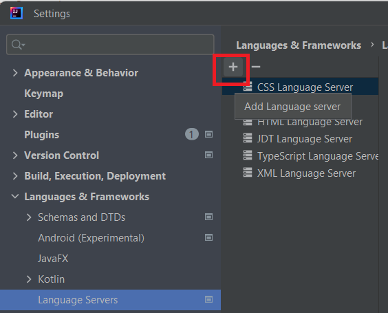
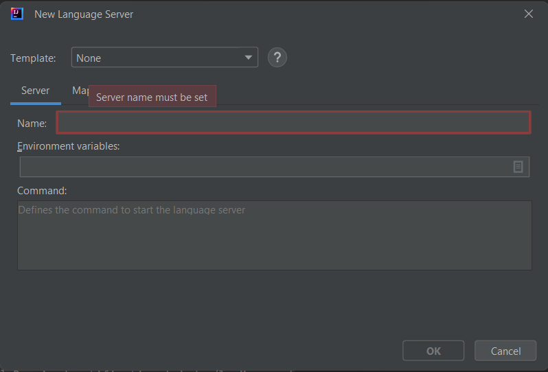
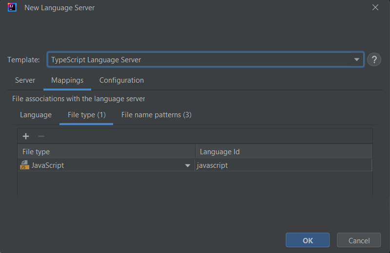

# User-defined language server

LSP4IJ provides the capability to consume any language server without developing
an IntelliJ plugin with `User-defined language server`.

The main idea is to: 

 * install the language server and its requirements(ex : `NodeJS` to 
execute a language server written in JavaScript/TypeScript), 
 * declare the command which starts the language server.
 * associate the language server with the proper files (identified by IntelliJ Language, File Type or file name pattern)

## New Language Server dialog

To create a new `User-defined language server` you need to open the `New Language Server` dialog, either:

 * from the menu on the right of the LSP console:

* or with the `[+]` on the top of the language server settings:

Once you clicked on either of them, the dialog will appear:

### Server tab

The `Server tab` requires to fill the `server name` and the `command` which will start the language server.

Here is a sample with the [typescript-language-server](https://github.com/typescript-language-server/typescript-language-server):

### Mappings tab

The `Mappings tab` provides the capability to `associate the language server with the proper files` identified by: 

 * [IntelliJ  Language](https://plugins.jetbrains.com/docs/intellij/custom-language-support.html) 
 * [IntelliJ File type](https://www.jetbrains.com/help/idea/creating-and-registering-file-types.html) 
 * `File name pattern`

Here are mappings samples with the [typescript-language-server](https://github.com/typescript-language-server/typescript-language-server):

 * The existing `JavaScript` file type is used to associate the file to the language server: 

* Since IntelliJ (Community) doesn't provide file type by default `TypeScript`, `React` file name patterns are used:

NOTE: it is better to use file name pattern instead of creating custom file type for TypeScript, since by default 
IntelliJ Community support `TypeScript syntax coloration` with `TextMate`. If you define a file type, you will
lose syntax coloration.

### Configuration tab

The `Configuration tab` allows to configure the language server with the expected (generally JSON format) configuration. 

Here are configuration sample with the [typescript-language-server](https://github.com/typescript-language-server/typescript-language-server):

### Debug tab

The `Debug tab` is available when you have created the language server definition. It allows to customize the 
level Trace used in LSP console.

### Using template

The `Template combo-box` provides some `language servers templates`, pre-filled with server name, command, mappings and potential configuration. 

 * [CSS Language Server](./user-defined-ls/vscode-css-language-server.md)
 * [HTML Language Server](./user-defined-ls/vscode-html-language-server.md)
 * [TypeScript Language Server](./user-defined-ls/typescript-language-server.md)
