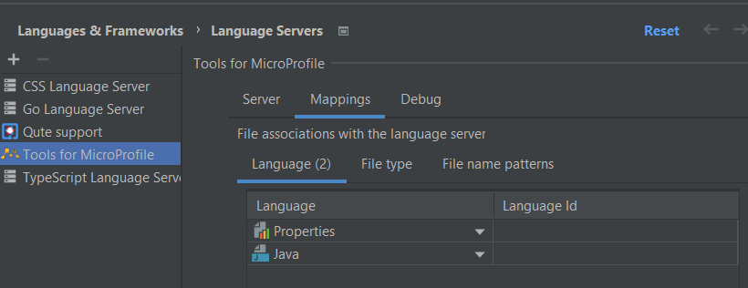
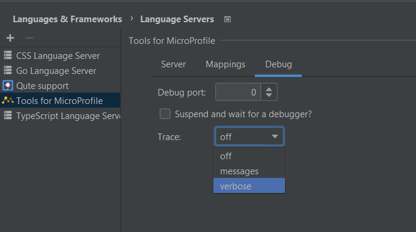
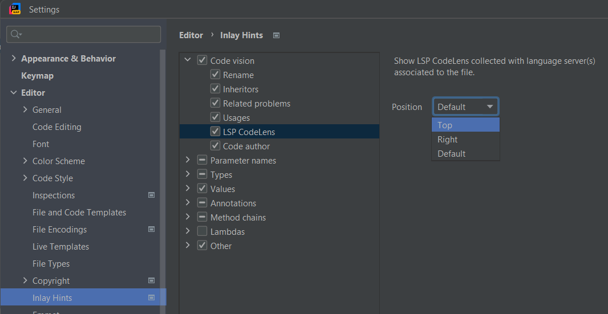
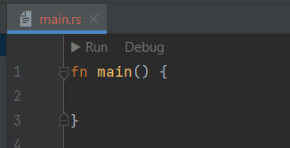
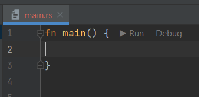
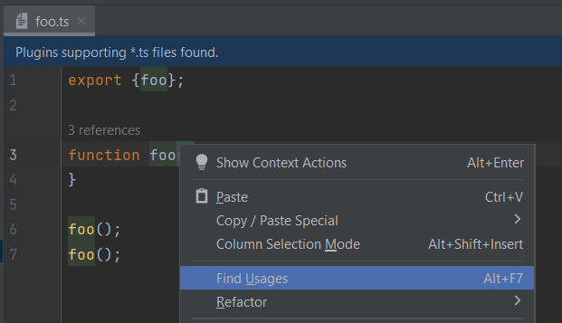
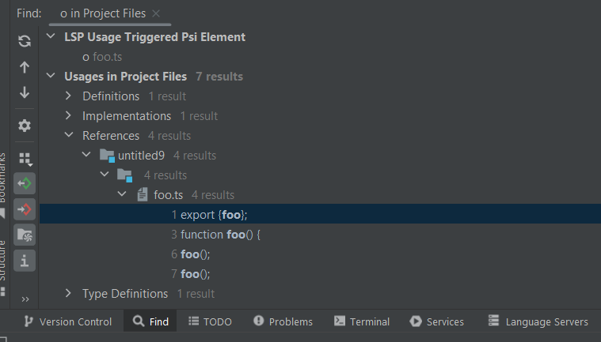

# User guide

## LSP console

Although not directly useful to users in most cases, the Language Server console view is extremely valuable 
when we need to troubleshoot issues with the language servers.

The state of the servers is visible, stop and restart is available with a right-click, and you can enable different levels of tracing:

The communication details between the IDE and the language servers are seen in the "LSP consoles" pane. 
In verbose mode, the messages can be expanded for more details:

When a language server is started, several actions are available, like stopping the language server or copying the command starting the language server :

## Settings

### Language Servers preferences

The preference page under `Preferences | Languages & Frameworks | Language Servers` allows power users 
to configure mappings, language servers debugging and tracing:

The `Mappings` tab shows the file associations with the language server:

The `Debug` tab allows to configure language servers debugging and tracing:

### LSP CodeLens

The standard preference page under `Preferences | Inlay Hints` allows to configure `LSP Codelens`:

You can configure LSP CodeLens on the `Top`:

or configure LSP CodeLens on the `Right`:

## Actions

### Formatting

The LSP formatting support can be done with the standard `Reformat Code` and `Reformat File` actions.

### Find Usages

The following LSP features are integrated with the standard `Find Usages` menu (provided they're supported by the underlying language server): 

* [Declarations](https://microsoft.github.io/language-server-protocol/specifications/lsp/3.17/specification/#textDocument_declaration)
* [Definitions](https://microsoft.github.io/language-server-protocol/specifications/lsp/3.17/specification/#textDocument_definition)
* [Type Definitions](https://microsoft.github.io/language-server-protocol/specifications/lsp/3.17/specification/#textDocument_typeDefinition)
* [References](https://microsoft.github.io/language-server-protocol/specifications/lsp/3.17/specification/#textDocument_references)
* [Implementations](https://microsoft.github.io/language-server-protocol/specifications/lsp/3.17/specification/#textDocument_implementation)

