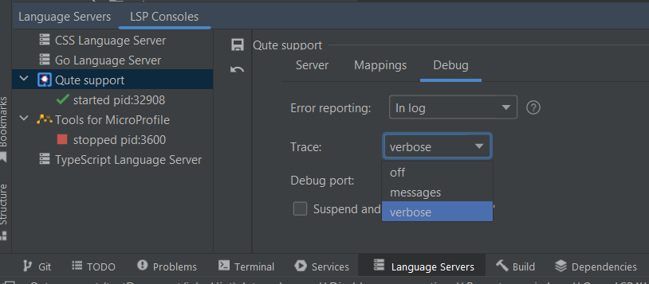
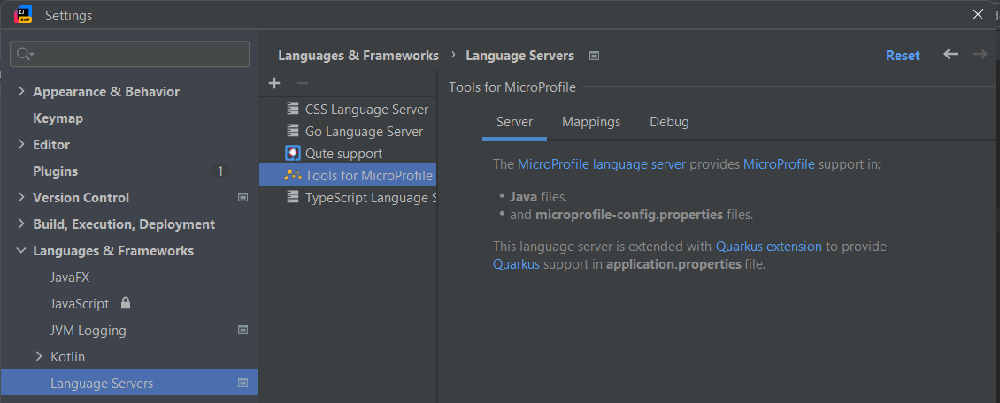

# User guide

## LSP console

Although not directly useful to users in most cases, the Language Server console view is extremely important 
when we need to troubleshoot issues with the language servers.

The state of the servers is visible, stop and restart is available with a right-click, and you can enable different levels of tracing:

The communication details between the IDE and the language servers are seen in the "LSP consoles" pane. 
In verbose mode, the messages can be expanded for more details:

When language server is started, several action like stopping the language server or copy the command which starts the language servers are available:

## Language Servers preferences

The preference page under `Preferences | Languages & Frameworks | Language Servers` allows power users 
to configure language servers debugging and tracing:

