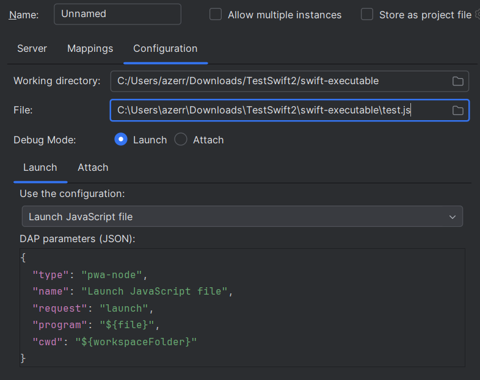
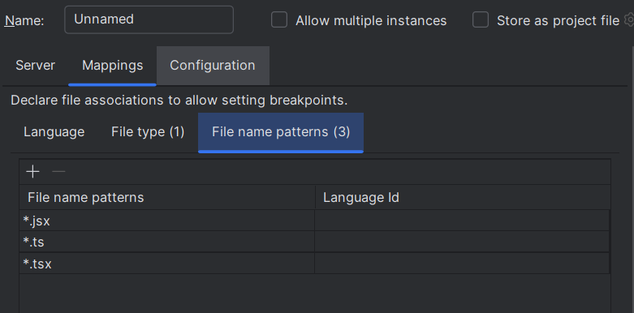

# Debug Adapter Protocol

LSP4IJ provides [Debug Adapter Protocol](https://microsoft.github.io/debug-adapter-protocol/) support
with the `Debug Adapter Protocol` run/debug configuration type:

After configuring the [DAP configuration type](#dap-configuration-type), you can debug your file.  
Here is an example with `JavaScript debugging`, which uses the [VSCode JS Debug DAP server](./user-defined-dap/vscode-js-debug.md):

## DAP Configuration Type:

To configure debugging with DAP, you need to fill in:

- The `Configuration` tab to specify the working directory and the file you want to run/debug:

  

- The `Mappings` tab to specify the files which can be debugged to allow adding/removing breakpoints:

- The `Server` tab to specify the DAP server:
 
  

## Templates

- [Go Delv DAP server](./user-defined-dap/go-delve)
- [Swift DAP Server](./user-defined-dap/swift-lldb.md)
- [VSCode JS Debug DAP Server](./user-defined-dap/vscode-js-debug.md)

