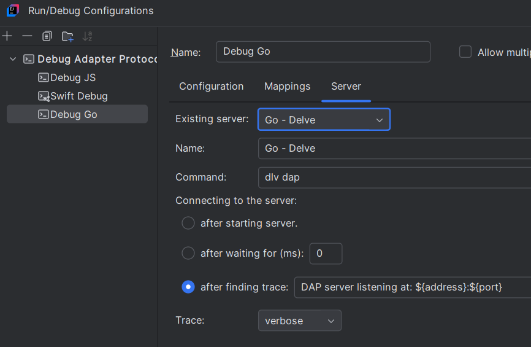
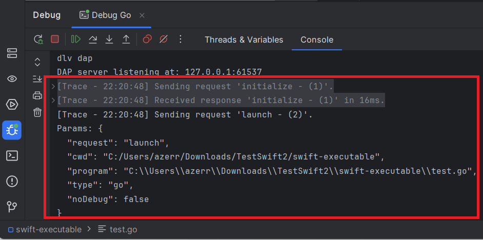
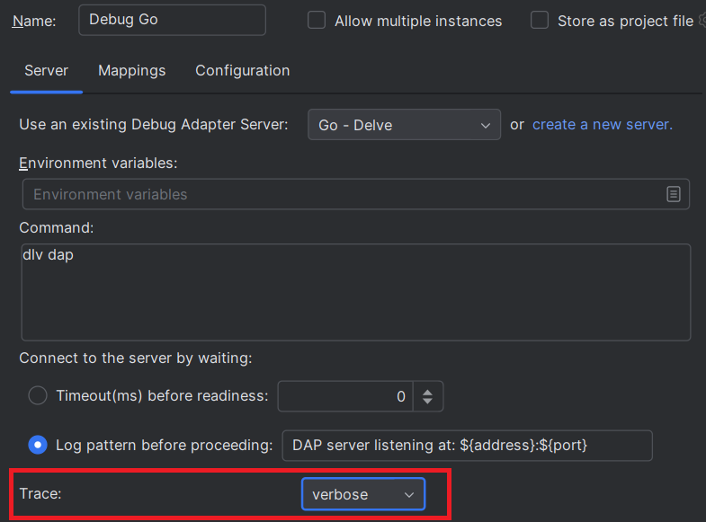
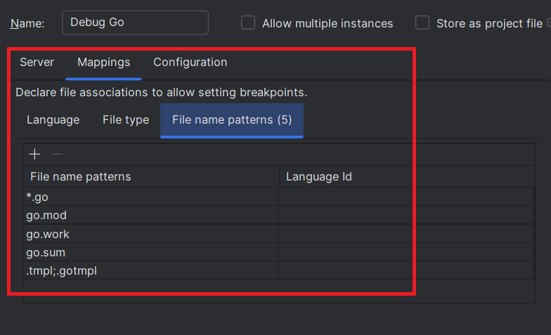
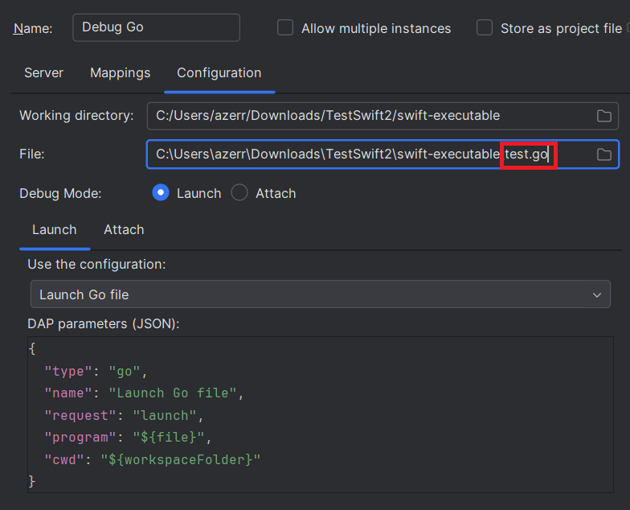
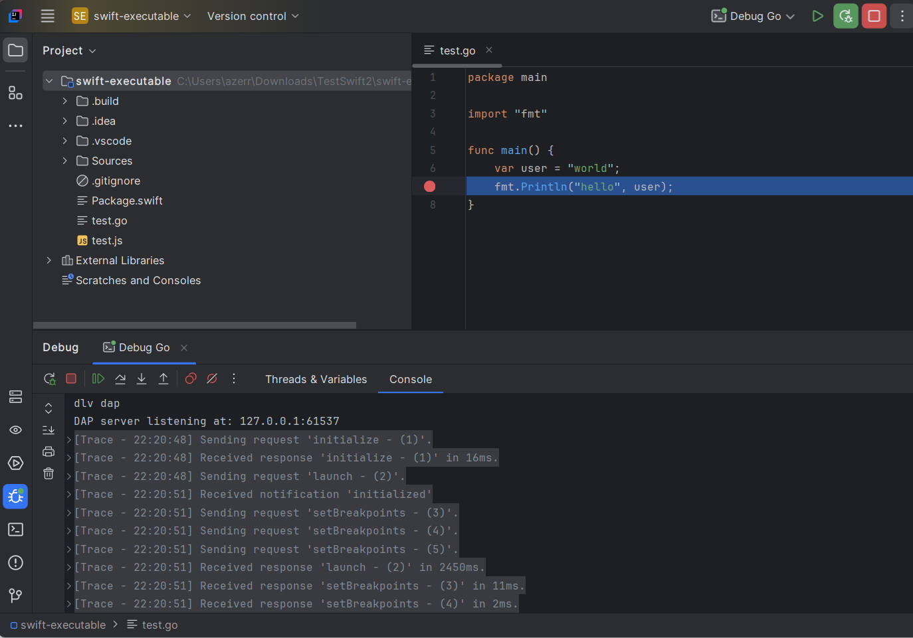
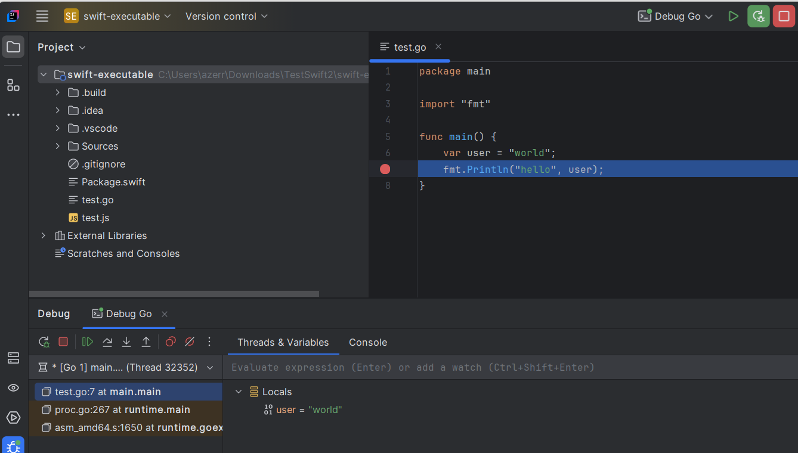

# Go - Delve

To debug `Go` files, you can use the [Delve](https://github.com/go-delve/delve) DAP server.

Let’s debugging the following `test.go` file:

```go
package main

import "fmt"

func main() {
    var user = "world";
    fmt.Println("hello", user);
}
```


 
## Configure DAP server

1. [Install Delve](https://github.com/go-delve/delve/tree/master/Documentation/installation#installation).

2. After the installation, you should have the `dlv` command available (make sure to close and reopen your IDE to ensure the `dlv` command is properly recognized).  

If you open a terminal and run the following command:

```
dlv dap
```

You should see in the terminal traces like this:

```
DAP server listening at: 127.0.0.1:60732
```

3. Create a DAP Run/Debug configuration:

   

4. In the `Server` tab, select `Go - Delve`.

   

This will automatically populate: 

 * the server `name`
 * the `command` which starts the DAP server which should look like this:

```
dlv dap
```

 * the `Connecting to the server` is set with `after finding trace` option with:

```
DAP server listening at: ${address}:${port}
```

This means the DAP (Debug Adapter Protocol) client will connect to the DAP server when this trace appears in the console:

```
dlv dap
DAP server listening at: 127.0.0.1:60732
```

Here `${port}` will be extracted and client will connect to the `60732` port.

5. Enable DAP server traces

If you wish to show DAP request/response traces when you will debug:



you need to select `Trace` with `verbose`.



## Configure file mappings

To allows settings breakpoints to Go files, you need configure mappings in the `Mappings` tab.
As you have selected `Go - Delve` server, it will automatically populate the file mappings like this:



## Configure the Go file to run/debug

1. Fill in the `Configuration` tab:

- the `working directory` (usually the project's root directory) 
- the path to the `test.go` file.



2. Select `Launch` as debugging type.
3. The DAP parameters of the launch should look like this:

```json
{
   "type": "go",
   "request": "launch",
   "program": "${file}",
   "cwd": "${workspaceFolder}"
}
```

When the run configuration starts:

- `${workspaceFolder}` will be replaced with the working directory you specified.
- `${file}` will be replaced with the full path to `test.go`.

## Set Breakpoint

After applying the run configuration, you should set a breakpoint to files which matches file mappings.
Set a breakpoint in the `test.go` file:


## Debugging

You can start the run configuration in either Run or Debug mode. Once started, you should see DAP traces in the console:



You will also see `Threads` and `Variables`:



## Language Support

If you need language support for Go (completion, validation, etc) you can [configure the Go Language Server](../../user-defined-ls/gopls.md)

